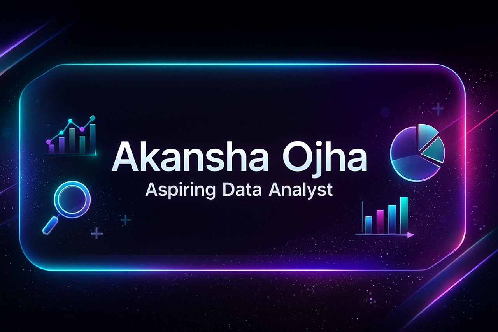

# 👋 Hey, I'm **Akansha Ojha**  
### Beginner Data Analyst • UI/UX Designer • Problem Solver

  

---

## 🎯 About Me

- 📊 **Beginner Data Analyst** exploring data cleaning, visualization & insights  
- 🎨 **UI/UX Designer** skilled in Figma, prototyping, user experience flow  
- ✨ Passionate about **data + design** and building impactful digital experiences  
- 🧠 Beginner in **Python, SQL, Pandas, Streamlit**  
- 🔍 Enjoy solving problems, exploring datasets & creating clean dashboards  

---

## ⚡ Tools & Technologies  

  
  
  
  
  
  
  
  
  

---

## 🚀 Featured Project  

### 🧹 **Multi–Format Data Cleaning & Processing App**
A Streamlit-based application that helps clean messy datasets (CSV, Excel, JSON, TXT, TSV), visualize insights, and download cleaned data in one click.

**Live App:** https://ewpqdxfwy5kyxthk7tjihs.streamlit.app/  
**Repo:** *Add your GitHub repo link here*

---

## 🎨 UI/UX Work Examples

- Designed multiple mobile & web UI screens using **Figma**  
- Experience in:  
  ✔ Wireframing  
  ✔ Prototyping  
  ✔ User Flow Design  
  ✔ Dashboard UI  
  ✔ Landing Page UI  

*(Upload your Figma or UI images/screenshots here later to show your work!)*

---

## 📚 Learning Journey

Currently learning:

- 📊 Data Cleaning & Analysis  
- 📈 Creating dashboards  
- 🐍 Python for Data  
- 🗃 SQL basics  
- 🖥 Streamlit apps  
- 🎨 Advanced UI/UX workflows  

---

## 📫 Connect With Me  

- 📧 **Email:** akanshaojha96956@gmail.com  
- 🔗 **LinkedIn:** https://www.linkedin.com/in/akansha-ojha  
- 🐙 **GitHub:** https://github.com/Akansha-Ojha  

---

  <i>“Good design + clean data = meaningful insights.”</i>

<!--
**Akansha-Ojha/Akansha-Ojha** is a ✨ _special_ ✨ repository because its `README.md` (this file) appears on your GitHub profile.

Here are some ideas to get you started:

- 🔭 I’m currently working on ...
- 🌱 I’m currently learning ...
- 👯 I’m looking to collaborate on ...
- 🤔 I’m looking for help with ...
- 💬 Ask me about ...
- 📫 How to reach me: ...
- 😄 Pronouns: ...
- ⚡ Fun fact: ...
-->
